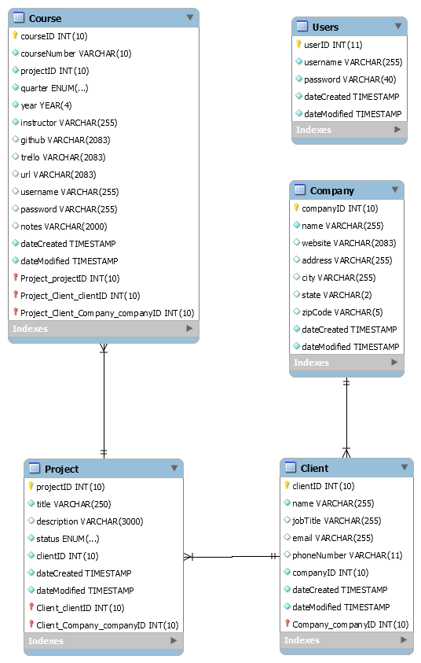

# Green River College Software Development Project Portal

<div style="text-align:center"></div>

## Project Summary

This project creates a tool for the faculty of Green River College to more effectively manage students' projects. When the faculty learns about a new project, they need a way to log it and record a description of the project along with the company and client information. Then, once a project is used in class, they need a way to keep track of the URL, login credentials, GitHub repository, and Trello link.

Many projects go through several iterations. So, they also need a way to view a projects history; including what class it was worked on, who was the teacher, and what changes did they make?

## Requirements
1. Separates all database/business logic using the MVC pattern.
    * The database/business logic is contained under `/models` with all class files contained under `/models/classes` and all classes that interact with the database are contained under `models/classes/Database`.
2. Routes all URLs and leverages a templating language using the Fat-Free framework.
    * All routes are handled in `index.php` and templates that are called are contained in `/views`. Some URLs have parameters which is passed to business logic for processing further data needed to view the page.
3. Has a clearly defined database layer using PDO and prepared statements.
    * Classes which interact with the database are under `models/classes/Database`. These are static classes, each getting their functionality to interact with the database from `models/classes/Database/db.php` which contains the RestDB class. The RestDB class is an abstract class containing generic functions for CRUD interactions using PDO. Each of RestDB's child classes can then call one of RestDB's methods with a SQL statement and applicable prams used in the SQL statement as a multi-dimensional array *(`':parameter' => array(value => dataType)`)*.
4. Data can be viewed, added, updated, and deleted.
	* All projects are listed on the homepage which can be clicked for more detail.
	* On the homepage, each project has a corrosponding delete project which will send a conformation message and delete the project.
	* A `New Project` button to add a new project is in the home page, which links to a form to create a new project.
	* From the project summary page, click `Edit Project Information` to edit the project.
	* The project summary page has a list of couses the project was used in. These courses can be clicked to go to the course summary page.
	* From the project summary page, each course has a corrosponding delete course which will send a conformation message and delete the course.
	* From the course summary page, click `Edit Course Information` to edit the course.
5. Has a history of commits from both team members to a Git repository.
	* The Git repository activity can be viewed at (https://github.com/QuentinGuenther/green-river-software-development-project-portal/graphs/contributors).
6. Uses OOP, and defines multiple classes, including at least one inheritance relationship.
	* The class diagram for this project can be viewed at (./uml/class-diagram.svg), along with at the bottom of this document.
7. Contains full Docblocks for all PHP files.
    * Each PHP file has Docblocks
8. Has full validation on the client side through JavaScript and server side through PHP.
	* The form validations for this project works by posting the form data then checking for errors in the data. If there are errors then they are added to a errors array. The page then checks to see if an error for the forrm group eists, if it does a corrosponding error message is displayed. If no errors are found then the server routes to the next page.
9. Incorporates jQuery and Ajax.
	* The course summary page uses GitHub's API to get each collaborator's username, GitHub profile, and email if it's available. The page does this by calling `javascripts/github-collabs.js` which gets the username and repo in the course's GitHub URL. The script then uses this information to access `api.github.com` in an ajax call, in this response a URL to the author's api.github.com URL is contained. This URL is then used to get information about the author. This script also handles `403 FORBIDDEN` when too many requests have been made to GitHub and `404 Not Found` when GitHub cannot find the repository. This script then uses JQuery to append collaborator's information or feedback when an error occurred to the collaborator's table on the course page.  
	This project also uses Javascript/JQuery to reroute when a project/course is clicked from the list or when the delete button is clicked, showing/hiding the username and password for course URL, and bootstrap/JQuery Data Tables.

## Languages and Frameworks
* PHP
* Fat-Free Framework
* HTML
* CSS, Bootstrap
* MySQL
* JavaScript, JQuery/Ajax

## Setup Requirements
* `git clone` this repository to the server.
* A new MySQL database must be made on the server, along with a user for the database with `SELECT`, `INSERT`, `UPDATE`, and `DELETE` privileges. The tables can be found under `tables.sql`
* Outside of `/public_html` on the Apache Server, a db_config.php needs to be created.
```
// db_config.php
<?php
    define( "DB_DSN", "mysql:dbname=DATABASE_NAME" );
    define( "DB_USERNAME", "DATABASE_USERNAME" );
    define( "DB_PASSWORD", "DATABASE_PASSWORD" );
```
* At the top of db.php there is a require_once statement that links to db_config.php.
* For each user in the system, run the following SQL statement on the database
```
INSERT INTO Users(username, password) VALUES ("foo@bar.com", SHA("password");
```

# Diagrams
## [MySQL Entity-Relationship Model](./uml/er-diagram.png)
<div style="text-align:center"></div>

## [Class Diagram](./uml/class-diagram.svg)
<div style="text-align:center"></div>

## Authors
* Quentin Guenther
* Nathan Corbin
